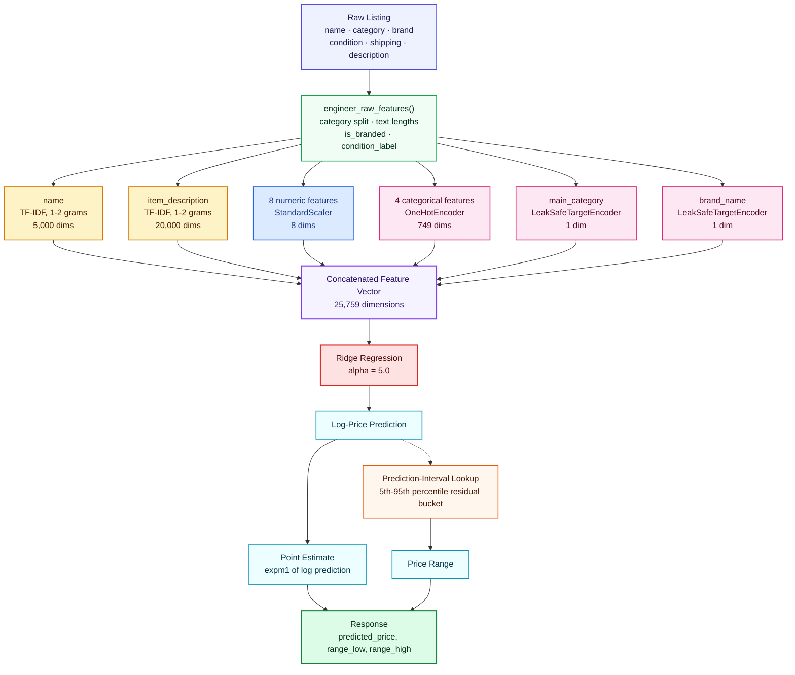
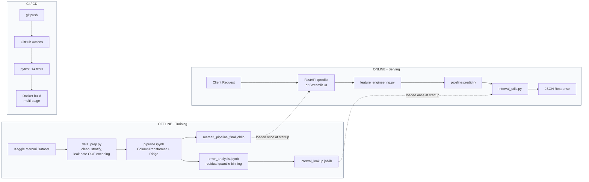

<div align="center">

# Mercari Price Prediction System

**End-to-end ML pipeline that prices secondhand marketplace listings from raw text and metadata — leak-safe feature engineering, a cross-validated model comparison, and a tested, containerized serving layer.**

[](https://www.python.org/)
[](https://scikit-learn.org/)
[](https://fastapi.tiangolo.com/)
[](https://streamlit.io/)
[](https://www.docker.com/)
[](https://github.com/Prashant-4527/mercari-price-prediction-system/actions/workflows/ci.yml)
[](LICENSE)
[](https://github.com/psf/black)
[](https://github.com/astral-sh/ruff)

[Overview](#overview) · [How It Predicts a Price](#how-it-actually-predicts-a-price) · [Architecture](#system-architecture) · [Getting Started](#getting-started) · [Results](#model-performance) · [Limitations](#known-limitations--roadmap)

**🔗 [Live demo](https://YOUR-APP.streamlit.app) · [API docs](https://YOUR-API.onrender.com/docs)** — replace with your deployed URLs (see [Deployment](#deployment))

</div>

---

### Quick start

```bash
git clone https://github.com/Prashant-4527/mercari-price-prediction-system.git && cd mercari-price-prediction-system
pip install -r requirements.txt
uvicorn api.main:app --reload
```

Trained model artifacts ship with the repository — no dataset or training step required to try the API.

---

## Table of Contents

- [Overview](#overview)
- [Highlights](#highlights)
- [How It Actually Predicts a Price](#how-it-actually-predicts-a-price)
- [System Architecture](#system-architecture)
- [Project Structure](#project-structure)
- [Tech Stack](#tech-stack)
- [Getting Started](#getting-started)
- [Deployment](#deployment)
- [API Usage](#api-usage)
- [Model Performance](#model-performance)
- [Error Analysis & Interpretability](#error-analysis--interpretability)
- [Prediction Intervals](#prediction-intervals)
- [Testing & CI](#testing--ci)
- [Known Limitations & Roadmap](#known-limitations--roadmap)
- [Related Work](#related-work)
- [License](#license)
- [Author](#author)

---

## Overview

Mercari is a customer-to-customer marketplace where **sellers set their own price** — a genuinely hard problem, since two visually similar listings (a $9.99 sweater and a $335 one) can differ enormously in real value for reasons a listing's raw text only hints at. This project builds a pricing system for exactly that problem: given a listing's name, category, brand, condition, shipping choice, and free-text description, it returns a **price suggestion and a calibrated range**, trained on the [Kaggle Mercari Price Suggestion Challenge](https://www.kaggle.com/c/mercari-price-suggestion-challenge/data) dataset.

It's built as a full pipeline, not a single notebook: leak-safe feature engineering, a fair cross-validated model comparison, error analysis grounded in real numbers, and a tested, containerized serving layer — the parts of an ML system a notebook alone doesn't cover.

---

## Highlights

- **RMSLE 0.5214** on held-out validation — beats both LightGBM and XGBoost tree ensembles once listing text is included in the feature set
- **25,759-dimension feature space** — TF-IDF text (25K dims) + structured features (10) + leak-safe target encoding, unified in a single `sklearn.Pipeline`
- **Leak-safe by construction** — stratified train/val split happens *before* any target encoding; training uses 5-fold out-of-fold encoding; low-count brands/categories are smoothed toward the global mean instead of overfitting to a handful of listings
- **14/14 tests passing**, verified on a fresh clone — endpoint contracts, edge cases, and feature-engineering correctness, run automatically on every push via GitHub Actions
- **Two serving surfaces** — a FastAPI REST API and a Streamlit demo, both loading the trained pipeline once at startup, both containerizable via a multi-stage Dockerfile
- **Every prediction ships with a calibrated price range**, not just a point estimate, via empirical residual-quantile intervals
- **Honest about what isn't solved yet** — luxury-item underprediction is measured, explained with SHAP, and tracked as an open problem rather than hidden (see [Limitations](#known-limitations--roadmap))

---

## How It Actually Predicts a Price

A raw listing becomes a price through one `sklearn.Pipeline` with a six-branch `ColumnTransformer` feeding a single `Ridge` regressor. Every dimension count below comes directly from the fitted pipeline shipped in `models/mercari_pipeline_final.joblib`.



`LeakSafeTargetEncoder` is a custom `sklearn`-native transformer (`src/pipeline_components.py`): it maps a category or brand to a **smoothed average price**, shrinking low-count groups toward the global mean (smoothing factor = 10) so a single luxury listing can't dominate its own group average. This is what makes the encoding safe to fit on the full training set without leaking the target.

---

## System Architecture

The offline training path and the online serving path are separate, and both feed off the same two versioned artifacts.



Both `api/main.py` and `streamlit_app/app.py` load the pipeline and interval lookup table **once at process startup**, not per request — the code comment in `api/main.py` is explicit about this being intentional.

---

## Project Structure

```
mercari-price-prediction-system/
├── .github/
│   └── workflows/
│       └── ci.yml                    # GitHub Actions — pytest on every push/PR to main
├── api/
│   └── main.py                       # FastAPI app — /health, /predict
├── models/
│   ├── mercari_pipeline_final.joblib # Shipped ColumnTransformer + Ridge pipeline (~1.2 MB)
│   └── interval_lookup.joblib        # Residual-quantile lookup table for price ranges
├── notebooks/
│   ├── pipeline.ipynb                # Final sklearn Pipeline: preprocessing + Ridge, fit + save
│   ├── model_comparison.ipynb        # Ridge vs LightGBM vs XGBoost, fair feature comparison
│   ├── error_analysis.ipynb          # Residual analysis, price-decile bias, interval calibration
│   └── shap_explainability.ipynb     # SHAP feature-importance study (diagnostic LightGBM model)
├── src/
│   ├── data_prep.py                  # Offline: cleaning, stratified split, leak-safe target encoding
│   ├── feature_engineering.py        # Online: raw listing -> model-ready features (serving path)
│   ├── pipeline_components.py        # Custom sklearn transformers (LeakSafeTargetEncoder, etc.)
│   └── interval_utils.py             # Converts a point prediction into a price range
├── streamlit_app/
│   ├── app.py                        # Interactive demo UI
│   └── requirements.txt
├── tests/
│   ├── test_api.py                   # 5 tests — endpoint contracts, request validation
│   ├── test_edge_cases.py            # 5 tests — unseen brands/categories, boundary values
│   └── test_feature_engineering.py   # 4 tests — feature-engineering correctness
├── Dockerfile                        # Multi-stage build (builder -> slim runtime)
├── .dockerignore
├── .gitignore
├── pytest.ini
├── requirements.txt                  # Full dev/training environment
├── requirements-prod.txt             # Minimal API runtime dependencies
└── README.md
```

---

## Tech Stack

| Layer | Technology |
|---|---|
| Language | Python 3.11+ |
| Data & Modeling | pandas, NumPy, scikit-learn, SciPy |
| Models Evaluated | Ridge Regression, LightGBM, XGBoost |
| Text Features | TF-IDF (`scikit-learn`) |
| Interpretability | SHAP |
| Serving | FastAPI, Uvicorn, Pydantic |
| Interactive Demo | Streamlit |
| Testing | pytest, httpx, FastAPI `TestClient` |
| Containerization | Docker (multi-stage build) |
| CI/CD | GitHub Actions |
| Artifact Storage | joblib |

---

## Getting Started

### Prerequisites
- Python 3.11+
- Docker (optional, for containerized serving)

### 1. Clone & install

```bash
git clone https://github.com/Prashant-4527/mercari-price-prediction-system.git
cd mercari-price-prediction-system

python -m venv venv
source venv/bin/activate   # Windows: venv\Scripts\activate

pip install -r requirements.txt
```

### 2. Run the tests

Trained model artifacts ship with the repository, so the full suite runs immediately — no dataset or training step required:

```bash
pytest tests/ -v
# 14 passed
```

### 3. Serve the API

```bash
uvicorn api.main:app --reload --port 8000
```

Interactive Swagger docs at `http://localhost:8000/docs`.

### 4. Or launch the interactive demo

```bash
pip install -r streamlit_app/requirements.txt
streamlit run streamlit_app/app.py
```

### 5. Or run it with Docker

```bash
docker build -t mercari-price-api .
docker run -p 8000:8000 mercari-price-api
```

### (Optional) Retrain from scratch

Only needed to reproduce or modify the model — the repository ships trained artifacts. Download the [Mercari Price Suggestion Challenge](https://www.kaggle.com/c/mercari-price-suggestion-challenge/data) dataset. It ships as tab-separated `train.tsv`, so convert it to CSV first:

```bash
python -c "import pandas as pd; pd.read_csv('train.tsv', sep='\t').to_csv('data/raw/mercari_sample.csv', index=False)"
```

Then:

```bash
python src/data_prep.py                         # cleans, splits, leak-safe target-encodes
jupyter notebook notebooks/pipeline.ipynb        # fits + saves the Ridge pipeline
jupyter notebook notebooks/error_analysis.ipynb  # builds the prediction-interval lookup
```

---

## Deployment

Both serving surfaces are stateless and load the trained pipeline once at startup, so either deploys as-is with no code changes.

**Streamlit demo → [Streamlit Community Cloud](https://streamlit.io/cloud) (free)**
1. Sign in with GitHub, click "New app"
2. Repository: this repo · Branch: `main` · Main file path: `streamlit_app/app.py`
3. Deploy — dependencies are picked up automatically from `streamlit_app/requirements.txt`

**FastAPI → [Render](https://render.com) (free tier) using the existing `Dockerfile`**
1. New → Web Service → connect this repo
2. Render detects `render.yaml` automatically (or manually set: Runtime = Docker, Health Check Path = `/health`)
3. Deploy — the same multi-stage `Dockerfile` used for local Docker runs is what ships to production, so there's no local/prod drift

Any other Dockerfile-based host (Railway, Fly.io, Google Cloud Run) works the same way with no changes.

---

## API Usage

| Endpoint | Method | Description |
|---|---|---|
| `/health` | GET | Liveness check |
| `/predict` | POST | Predict a price for a listing |

**Request**

```bash
curl -X POST http://localhost:8000/predict \
  -H "Content-Type: application/json" \
  -d '{
    "name": "Chanel Classic Flap Bag Medium Caviar",
    "item_condition_id": 3,
    "category_name": "Women/Bags/Shoulder Bag",
    "brand_name": "Chanel",
    "shipping": 0,
    "item_description": "Barely used, comes with dust bag and authenticity card"
  }'
```

**Response**

```json
{
  "predicted_price": 100.53,
  "price_range_low": 39.21,
  "price_range_high": 292.02
}
```

*A real, live response from this pipeline — see [Error Analysis](#error-analysis--interpretability) for why a genuine Chanel bag still lands well below its real resale value.*

`brand_name` and `item_description` are optional; the model falls back gracefully for unbranded, undescribed listings (covered by the test suite).

**More live examples:**

| Listing | Predicted | Range |
|---|---|---|
| Chanel Classic Flap Bag, Caviar leather | $100.53 | $39.21 – $292.02 |
| iPhone 8 Plus 64GB, good condition | $126.73 | $49.58 – $367.64 |
| Kids graphic-tee bundle (3-pack), no brand | $17.52 | $7.75 – $42.41 |

---

## Model Performance

All models are validated on the same held-out 9,945-row stratified split (20% of the cleaned ~49.7K-row dataset), scored on **RMSLE** — the standard metric here, since it penalizes relative rather than absolute error across a price range spanning a few dollars to well over a thousand.

**Fair comparison — every model gets the same 10 structured features, no text:**

| Model | Single-split RMSLE | 5-fold CV RMSLE (mean ± std) |
|---|---|---|
| Ridge Regression | 0.5983 | — |
| XGBoost | 0.5753 | 0.5699 ± 0.0021 *(early stopping)* |
| LightGBM | 0.5677 | 0.5654 ± 0.0022 *(early stopping)* |

On equal footing, both tree ensembles beat linear regression — the expected result for tabular data with non-linear interactions.

**Adding listing text changes the winner:**

| Model | Features | Val RMSLE |
|---|---|---|
| LightGBM (best tree model) | 10 structured features | 0.5677 |
| **Ridge (shipped)** | **10 structured + TF-IDF name (5K) + TF-IDF description (20K) = 25,759 dims** | **0.5214** |

Once the listing's **name** and **description** are vectorized and handed to Ridge, it leapfrogs both tree ensembles — free text carries pricing signal (brand mentions, materials, size, condition language) that the ten structured features alone don't capture. It isn't that Ridge is inherently the stronger model here — in this comparison it's the only one of the three evaluated with the listing text included. Feeding the same TF-IDF features into LightGBM/XGBoost is a natural next experiment (see [Roadmap](#known-limitations--roadmap)).

> **Note on rigor:** 0.5214 is a single-split number, unlike the CV numbers reported for the structured-only candidates above — TF-IDF refitting per fold makes 5-fold CV on the full 25,759-dim pipeline noticeably slower, which is why it wasn't run initially. `scripts/cross_validate_final_model.py` reconstructs the exact shipped architecture and reports 5-fold CV RMSLE ± std for it, so this can be put on the same footing on request.

---

## Error Analysis & Interpretability

### Overall error distribution
*(evaluated on the 9,945-row validation set)*

| Metric | Value |
|---|---|
| Mean Absolute Error | $11.90 |
| Median Absolute Error | $5.30 |
| 90th percentile error | $22.99 |
| 99th percentile error | $115.10 |
| Max error | $1,450.12 |

### The model systematically underprices expensive listings

Bucketing validation listings into ten price deciles and averaging the **signed** error (predicted − actual) in each reveals a clean monotonic drift:

| Price Decile | Avg. Signed Error |
|---|---|
| 0 (cheapest) | +$5.21 |
| 1 | +$4.60 |
| 2 | +$3.66 |
| 3 | +$3.09 |
| 4 | +$1.86 |
| 5 | +$0.39 |
| 6 | −$0.95 |
| 7 | −$3.93 |
| 8 | −$10.02 |
| 9 (priciest) | **−$56.48** |

Cheap listings are slightly overpriced; the priciest decile is underpriced by **$56 on average**. The worst individual misses in validation are almost all luxury or premium-brand items — a Chanel bag, an Alexander McQueen clutch, Christian Louboutin heels, a Louis Vuitton wallet. This is a real, unresolved gap — see [Limitations](#known-limitations--roadmap).

### Why: a SHAP feature-importance study

> This study runs against a separate, structured-only LightGBM model (`notebooks/shap_explainability.ipynb`), not the shipped Ridge pipeline — SHAP's `TreeExplainer` doesn't apply to Ridge's sparse TF-IDF feature space. The goal is to understand what drives structured-feature pricing signal; see [Limitations](#known-limitations--roadmap) for why this doesn't yet explain the deployed model directly.

| Feature | Share of Model Output (mean \|SHAP\|) |
|---|---|
| `brand_avg_price` | 27.4% |
| `sub_sub_category` | 21.0% |
| `shipping` | 16.3% |
| `sub_category` | 10.7% |
| `item_condition_id` | 9.7% |
| `desc_length` | 7.0% |
| `name_length` | 4.3% |
| `name_word_count` | 1.1% |

`brand_avg_price` and category dominate — which explains the underpricing pattern above. A smoothed group average intentionally pulls rare, expensive brands toward the category mean (that's what makes the encoding leak-safe and stable for low-count brands), but the same smoothing mutes exactly the signal a real Chanel or Louis Vuitton listing needs to stand out.

The concrete case that motivated this analysis:

> **"Chanel Classic Flag Bag medium Caviar L"** — actual price **$1,506**. The structured-only LightGBM model predicted **$43.69** (baseline $18.61 → +$17.20 from `brand_avg_price` → +$13.15 from `sub_sub_category` → −$7.17 from `desc_length`). Running the same listing live through the **shipped Ridge+text pipeline** — which does read the listing text — still returns roughly **$100**: better, because text features catch some of what structured features miss, but nowhere near market value.

---

## Prediction Intervals

Every prediction ships with a price **range**, not just a point estimate — a real pricing tool needs sellers to know how much to trust a single number.

**Method:** predict on the validation set, compute residuals in log-space, bucket listings into 5 quantile bins **by predicted price** (actual price is unknown at inference time), then take the empirical 5th–95th percentile of residuals within each bin. At inference, the point prediction's bin determines which offset to apply.

| Predicted Price Bin | 5th–95th Percentile Residual (log-space) |
|---|---|
| $2 – $12 | [−0.711, +0.776] |
| $12 – $15 | [−0.700, +0.769] |
| $15 – $20 | [−0.750, +0.852] |
| $20 – $28 | [−0.807, +0.929] |
| $28 – $421 | [−0.926, +1.060] |

Interval width grows with price — consistent with the error pattern above: the model is least confident exactly where it's least accurate.

---

## Testing & CI

**14 tests, 3 files, verified passing on a fresh clone:**

| File | Tests | Covers |
|---|---|---|
| `tests/test_api.py` | 5 | Endpoint contracts — health check, valid/invalid requests, missing fields, optional-field defaults |
| `tests/test_edge_cases.py` | 5 | Unseen brands/categories (no crash), condition-ID boundaries (1 & 5 accepted, 0 & 6 rejected), empty descriptions |
| `tests/test_feature_engineering.py` | 4 | Category splitting, missing-brand defaulting, missing-description flagging, condition-label mapping |

```bash
pytest tests/ -v
# ============================= 14 passed in 1.69s ==============================
```

GitHub Actions (`.github/workflows/ci.yml`) runs two jobs on every push and pull request to `main`, on Python 3.11:
- **`test`** — the pytest suite above
- **`lint`** — [`ruff`](https://github.com/astral-sh/ruff) (imports, unused code, style) and [`black --check`](https://github.com/psf/black) (formatting), config in `pyproject.toml`

---

## Known Limitations & Roadmap

Honest bookkeeping on what's still rough, roughly in the order it'd get addressed:

1. **Serving requires a placeholder `price` column.** The `ColumnTransformer`'s two `LeakSafeTargetEncoder` branches are wired to select `["main_category", "price"]` / `["brand_name", "price"]` — `price` is only needed at *fit* time (to compute group means inside `fit()`); `transform()` never reads it. But scikit-learn's column selection still requires the column to exist on any DataFrame passed through the pipeline, so both `api/main.py` and `streamlit_app/app.py` currently work around this with `raw_df["price"] = 0` before inference. **Fix:** decouple the encoder's `transform()` column contract from its `fit()` dependency, e.g. by capturing the mapping via closure instead of a shared column list.
2. **Feature engineering is duplicated, not shared**, between the offline training path (`src/data_prep.py`) and the online serving path (`src/feature_engineering.py`). They currently produce equivalent output, but nothing enforces that they stay that way — a classic train/serve skew risk. **Fix:** extract one shared feature-engineering function used by both paths.
3. **The SHAP interpretability study explains a diagnostic model, not the shipped one.** `notebooks/shap_explainability.ipynb` runs `TreeExplainer` against a structured-only LightGBM model, because `TreeExplainer` doesn't apply to the shipped Ridge pipeline's sparse TF-IDF feature space. It's useful for understanding structured-feature importance (see [Error Analysis](#error-analysis--interpretability)), but doesn't yet explain what the *deployed* model is actually weighting. **Fix:** a `shap.LinearExplainer` pass against the Ridge pipeline's real feature matrix.
4. **High-price listings are underpriced.** The top price decile is underpredicted by ~$56 on average — a genuine capability gap, not a bug. **Direction:** a two-stage approach (classify "likely premium," route to a specialized regressor) or quantile regression to widen tail sensitivity.

---

## Related Work

Part of a broader look at the Mercari marketplace — see also [`mercari-price-analysis`](https://github.com/Prashant-4527/mercari-price-analysis), an exploratory notebook series on the same dataset that this project's modeling builds on.

---

## License

MIT — see [LICENSE](LICENSE).

---

## Author

Built by [**Prashant-4527**](https://github.com/Prashant-4527) on GitHub.